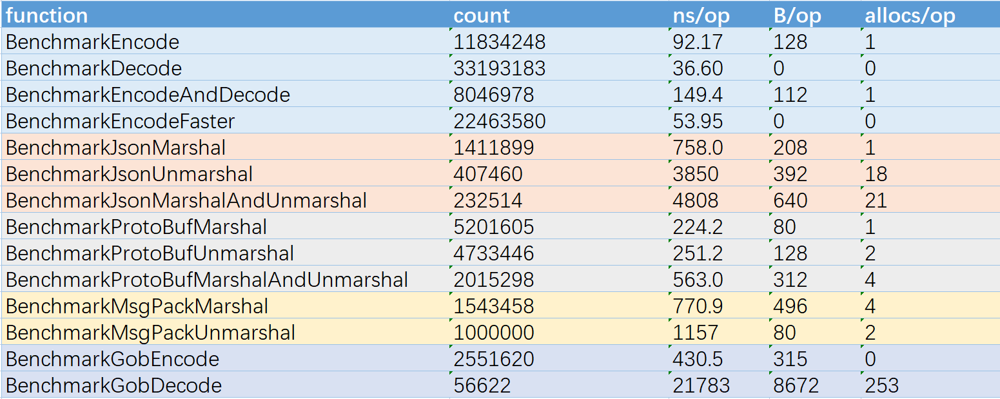

# go-jeans
go-jeans是一个快速的序列化、反序列化库，是出于替代手动封装数据结构带来的繁琐问题，其性能远超当下主流的编码格式
### 特性
- 脱离反射机制
- 快速
- 内存占用小（比pb更小）
- CPU消耗低
- 堪比手动封装
- 仅支持Go中的基本数据类型和字节切片

### Benchmark测试
数据来自我的联想笔记本电脑
```
go test -run=none -cpu 1 -benchmem -bench=Benchmark
goos: windows
goarch: amd64
pkg: github.com/Li-giegie/go-jeans
cpu: AMD Ryzen 5 5600H with Radeon Graphics
```



### 下载安装
``` 
go get -u github.com/Li-giegie/go-jeans
```

### 使用方法
```go
// 编码（序列化） 将go中的基本值类型进行编码，编码的参数和解码的参数顺序必须一致，只有在传递的类型不支持时会返回错误，其他情况不会，注意这一步并不打包返回的切片
func TestEncode(t *testing.T) {
    var s struct{
        A int
        B string
        C bool
    }

    buf ,err := Encode(s.A,s.B,s.C)
    if err != nil {
        return
    }
    fmt.Println(buf)
}

// 解码 将一个字节切片序列化成入参的值，参数要求是GO的基本类型，指针形式传递，编码的参数和解码的参数顺序必须一致
func TestDecode(t *testing.T) {
    var s struct{
        A int
        B string
        C bool
    }
    buf, _ := Encode(s.A,s.B,s.C)
    err := Decode(buf,&s.A,&s.B,&s.C)
    if err != nil {
        return
    }
    fmt.Println(s)
}

// 快速编码
func TestEncodeFaster(t *testing.T) {
    type base struct {
        I  int
        Ui uint
        Bo bool
        B  byte
        Bs []byte
        S  string
    }
    var encodeBase = new(base)
    //伪造数据
    err := faker.FakeData(encodeBase)
    if err != nil {
        t.Error(err)
        return
    }
    // 1.创建一个缓冲切片，容量我们要预估一下，尽量不要让内存不够多次分配会占用可观的性能
    // 结构体中变量的大概占用大小，处了[]byte、string外其他的内存占用是确定的，[]byte、string处了本身的长度外还包活一个长度字段占4个字节，只有知道长度信息才能够还原
    bufCap := 8 + 8 + 1 + 1 + (4 + 100) + (4 + 100)
    // 切片的长度一定是0，容量是我们预估的,CountLength()函数可以计算容量
    buf := make([]byte, 0, bufCap)
    buf, err = EncodeFaster(buf, encodeBase.I, encodeBase.Ui, encodeBase.B, encodeBase.Bs, encodeBase.Bo, encodeBase.S)
    if err != nil {
        t.Error(err)
        return
    }
    // 解码验证
    decodeBase := new(base)
    if err = Decode(buf, &decodeBase.I, &decodeBase.Ui, &decodeBase.B, &decodeBase.Bs, &decodeBase.Bo, &decodeBase.S); err != nil {
        t.Error(err)
        return
    }
    if !reflect.DeepEqual(encodeBase, decodeBase) {
        t.Error("decode fail")
        return
    }
    fmt.Printf("encodeBase: %v \ndecodeBase: %v\n", encodeBase, decodeBase)
}
```
### 注意事项
编解码支持的类型仅为Go中的基本类型：int、int8 ~ int64、uint、uint8 ~ uint64、bool、string、float32~64、byte、[]byte(比较常用)，后续考录支持更多的类似

[Encode 编码|序列化：](#) 入参必须为Go中的基本类型，如果确认入参全部被支持，可忽略错误，如果出现错误会返回入参的顺序，例如如果s.A不被支持即返回信息中包含index 0

[Decode 解码|反序列化：](#) 入参必须为Go中的<span style="color: pink">指针基本类型</span>，如果不是指针返回错误，编码的顺序和解码的顺序需要保持一致，可参考使用方法中的示例

### TODO
优化代码

支持切片类型（当前支持[]uint32）

支持更多类型

